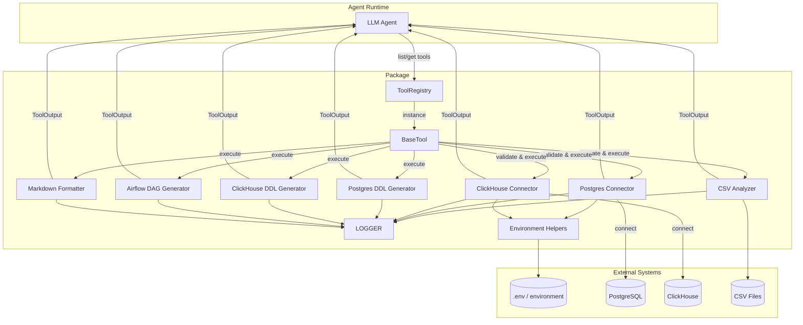

# LLM Tools Overview
Таже диаграмма в mermaid-diagram-2025-09-29-112412.png

## Environment Configuration

Connection tools automatically pull missing parameters from environment variables. Populate these keys (e.g. in `.env`) to avoid passing credentials explicitly:

- PostgreSQL:
  - `POSTGRES_HOST`
  - `POSTGRES_PORT`
  - `POSTGRES_DB`
  - `POSTGRES_USER`
  - `POSTGRES_PASSWORD`
  - `POSTGRES_USE_SSL`
  - `POSTGRES_TIMEOUT`

- ClickHouse:
  - `CLICKHOUSE_HOST`
  - `CLICKHOUSE_PORT`
  - `CLICKHOUSE_DB`
  - `CLICKHOUSE_USER`
  - `CLICKHOUSE_PASSWORD`
  - `CLICKHOUSE_USE_SSL`
  - `CLICKHOUSE_TIMEOUT`

Missing values in tool calls are filled from these variables via `LLM_tools.utils.env`.

