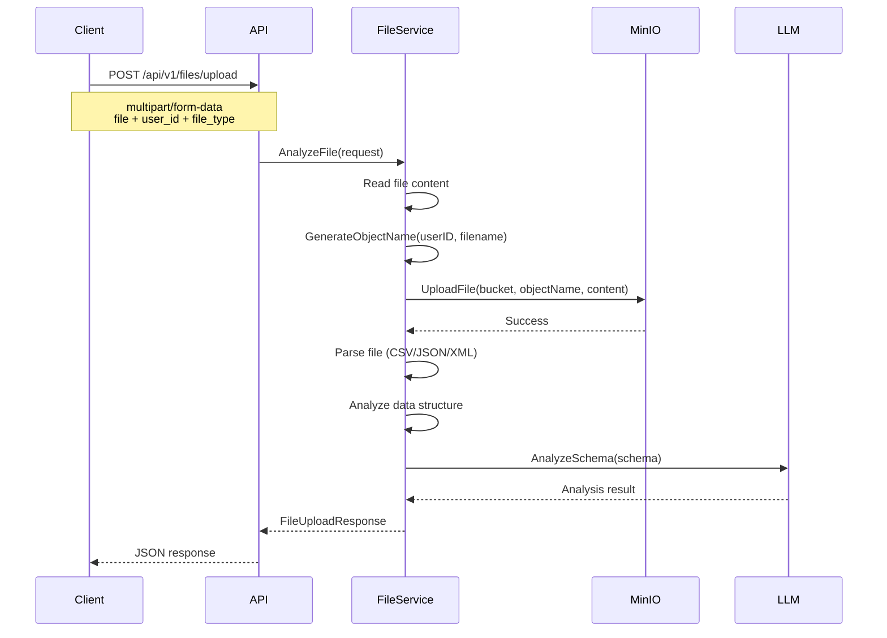

# Логика хранения файлов в MinIO

## Как система определяет пользователя

### 1. Источники userID

Система получает `userID` из нескольких источников в порядке приоритета:

1. **Form параметр** (высший приоритет):
   ```bash
   curl -X POST -F "file=@test.csv" -F "user_id=user123" http://localhost:8082/api/v1/files/upload
   ```

2. **JWT токен** (если реализована аутентификация):
   ```go
   // Из middleware аутентификации
   userID := c.GetString("user_id")
   ```

3. **Default значение** (низший приоритет):
   ```go
   if userID == "" {
       userID = "default_user" // По умолчанию
   }
   ```

### 2. Структура хранения в MinIO

```
ai-data-engineer/                    # Bucket
├── users/
│   ├── user123/                     # Папка пользователя
│   │   ├── files/                   # Папка файлов
│   │   │   ├── 20241016_235900_data.csv
│   │   │   ├── 20241016_235901_report.json
│   │   │   └── 20241016_235902_config.xml
│   │   └── analysis/                # Папка анализов (будущее)
│   ├── user456/
│   │   └── files/
│   └── default_user/                # Для неавторизованных пользователей
│       └── files/
```

### 3. Генерация имени файла

```go
func GenerateObjectName(userID, filename string) string {
    // Формат: users/{userID}/files/{timestamp}_{clean_filename}
    timestamp := time.Now().Format("20060102_150405")
    ext := filepath.Ext(filename)
    nameWithoutExt := strings.TrimSuffix(filename, ext)
    
    // Очищаем имя файла от недопустимых символов
    cleanName := strings.ReplaceAll(nameWithoutExt, " ", "_")
    cleanName = strings.ReplaceAll(cleanName, "/", "_")
    cleanName = strings.ReplaceAll(cleanName, "\\", "_")
    
    return fmt.Sprintf("users/%s/files/%s_%s%s", userID, timestamp, cleanName, ext)
}
```

**Примеры:**
- `user123` + `data.csv` → `users/user123/files/20241016_235900_data.csv`
- `user456` + `report with spaces.json` → `users/user456/files/20241016_235901_report_with_spaces.json`

### 4. Определение Content-Type

```go
func GetContentType(filename string) string {
    ext := strings.ToLower(filepath.Ext(filename))
    switch ext {
    case ".csv":  return "text/csv"
    case ".json": return "application/json"
    case ".xml":  return "application/xml"
    case ".txt":  return "text/plain"
    case ".xlsx": return "application/vnd.openxmlformats-officedocument.spreadsheetml.sheet"
    case ".xls":  return "application/vnd.ms-excel"
    default:      return "application/octet-stream"
    }
}
```

## Поток обработки файла

### 1. Загрузка файла


### 2. Извлечение пользователя из объекта

```go
func GetUserFromObjectName(objectName string) string {
    // Формат: users/{userID}/files/{filename}
    parts := strings.Split(objectName, "/")
    if len(parts) >= 2 && parts[0] == "users" {
        return parts[1]
    }
    return ""
}
```

## Безопасность и изоляция

### 1. Изоляция пользователей
- Каждый пользователь имеет свою папку: `users/{userID}/`
- Пользователи не могут получить доступ к файлам других пользователей
- Bucket-level политики обеспечивают изоляцию

### 2. Уникальность файлов
- Timestamp в имени файла предотвращает конфликты
- Очистка имени файла от недопустимых символов
- Автоматическое создание bucket если не существует

### 3. Graceful degradation
```go
// Если MinIO недоступен, анализ продолжается
err = s.minioClient.UploadFile(ctx, "ai-data-engineer", objectName, ...)
if err != nil {
    s.logger.WithField("error", err.Error()).Warn("Failed to save file to MinIO, continuing with analysis")
    // Продолжаем анализ даже если не удалось сохранить в MinIO
}
```

## Конфигурация MinIO

### Environment Variables
```bash
MINIO_ENDPOINT=localhost:9000
MINIO_ACCESS_KEY_ID=minioadmin
MINIO_SECRET_ACCESS_KEY=minioadmin
MINIO_USE_SSL=false
```

### Config Structure
```go
type MinIOConfig struct {
    Endpoint        string `yaml:"endpoint" mapstructure:"endpoint"`
    AccessKeyID     string `yaml:"access_key_id" mapstructure:"access_key_id"`
    SecretAccessKey string `yaml:"secret_access_key" mapstructure:"secret_access_key"`
    UseSSL          bool   `yaml:"use_ssl" mapstructure:"use_ssl"`
}
```

## API Endpoints для работы с файлами

### 1. Загрузка файла
```bash
curl -X POST \
  -F "file=@data.csv" \
  -F "user_id=user123" \
  -F "file_type=csv" \
  -F "target_db=postgresql" \
  http://localhost:8082/api/v1/files/upload
```

### 2. Получение информации о файле
```bash
curl -X GET http://localhost:8082/api/v1/files/file_1697486400
```

### 3. Список файлов пользователя
```bash
curl -X GET "http://localhost:8082/api/v1/files?user_id=user123&limit=10&offset=0"
```

### 4. Удаление файла
```bash
curl -X DELETE http://localhost:8082/api/v1/files/file_1697486400
```

## Мониторинг и логирование

### Логи MinIO операций
```json
{
  "level": "info",
  "time": "2024-10-16T23:59:00+03:00",
  "message": "Uploading file to MinIO",
  "bucket": "ai-data-engineer",
  "object": "users/user123/files/20241016_235900_data.csv"
}
```

### Метрики
- Количество загруженных файлов по пользователям
- Размер хранилища по пользователям
- Время отклика MinIO операций
- Ошибки загрузки/скачивания

## Будущие улучшения

1. **Аутентификация**: JWT токены для автоматического определения userID
2. **Квоты**: Ограничения на размер и количество файлов пользователя
3. **Версионирование**: Сохранение истории изменений файлов
4. **Шифрование**: Шифрование файлов перед сохранением
5. **CDN**: Интеграция с CDN для быстрого доступа к файлам
