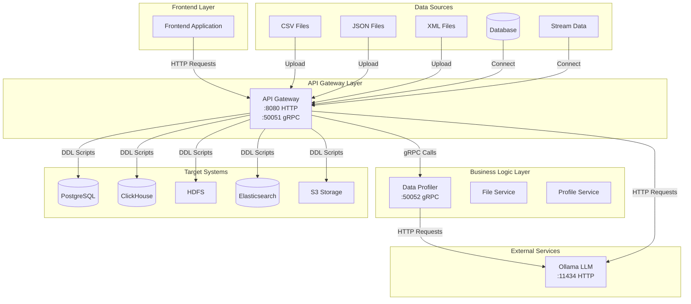
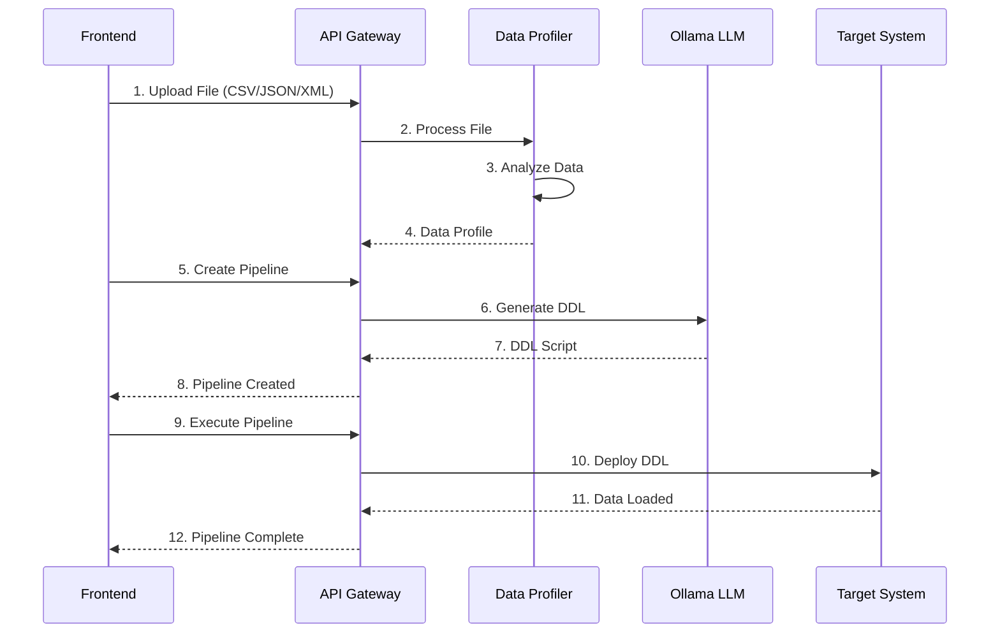

# Диаграмма архитектуры AIEN Backend

## Общая архитектура системы

## Поток данных

## Компоненты системы

### API Gateway
- **Порт**: 8080 (HTTP), 50051 (gRPC)
- **Функции**:
  - Единственная точка входа
  - Проксирование запросов
  - Интеграция с LLM
  - Управление пайплайнами

### Data Profiler
- **Порт**: 50052 (gRPC)
- **Функции**:
  - Загрузка и обработка файлов
  - Анализ структуры данных
  - Профилирование качества данных
  - Преобразование в единый формат

### Ollama LLM
- **Порт**: 11434 (HTTP)
- **Функции**:
  - Анализ профиля данных
  - Генерация DDL скриптов
  - Рекомендации по оптимизации
  - Создание индексов и ограничений

## Поддерживаемые форматы данных

| Формат | Размер | Описание | Использование |
|--------|--------|-----------|---------------|
| CSV | до 1GB | Структурированные данные | Транзакционные системы |
| JSON | до 1GB | Полуструктурированные данные | API и веб-приложения |
| XML | до 1GB | Иерархические данные | Документооборот |
| Database | - | Прямое подключение | Существующие БД |
| Stream | - | Потоковые данные | Real-time обработка |

## Целевые системы хранения

| Система | Тип | Оптимизация | Использование |
|---------|-----|-------------|----------------|
| PostgreSQL | OLTP | ACID, индексы | Транзакционные данные |
| ClickHouse | OLAP | Колоночное хранение | Аналитика и отчеты |
| HDFS | Big Data | Распределенное хранение | Большие объемы |
| Elasticsearch | Search | Поисковые индексы | Логи и поиск |
| S3 | Object Storage | Объектное хранение | Архивирование |

## Безопасность и масштабируемость

### Безопасность
- Аутентификация через API ключи
- Шифрование данных в транзите
- Изоляция сервисов в Docker
- Валидация входных данных

### Масштабируемость
- Горизонтальное масштабирование сервисов
- Асинхронная обработка больших файлов
- Кэширование результатов анализа
- Оптимизация gRPC соединений